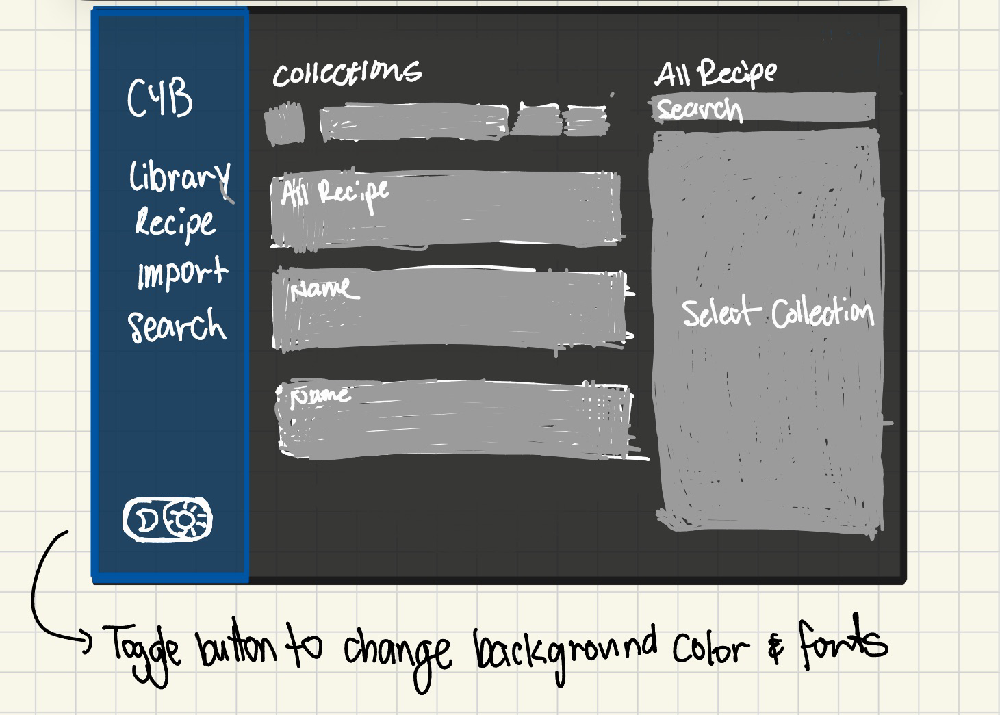
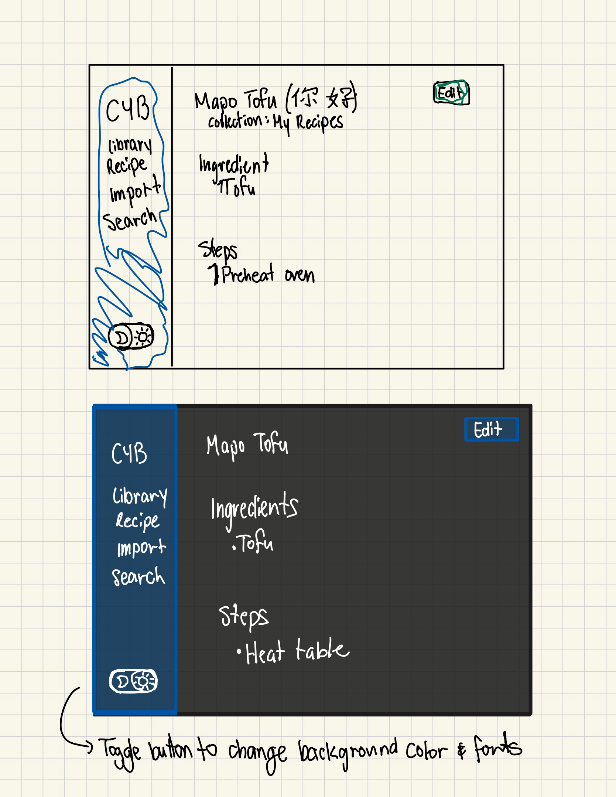

## Design Evolution

### Wireframes

### Initial Implementation

Inital implementation

### Version 2

Moved dark mode button to the left

### Final implementation

Moved dark mode button to in the column under the different tabs. Renamed "Switch to __" to "Dark/Light Mode" with icon. Edit/save button in recipe editor is now blue to better match the blue theme.

## Rationale
We made the above changes to better match the visual aesthetic and intuitiveness of changing the theme. Straying from the wireframe, we decided to go with dark blues, as the original CYB already had a mild blue theme going on. We also decided to move the button just to keep the main controls all on one side of the screen. We changed the button's label from "Switch to __" to "Dark/Light Mode" to make it more clear to the user what the button does and to make it more aesthetically pleasing.