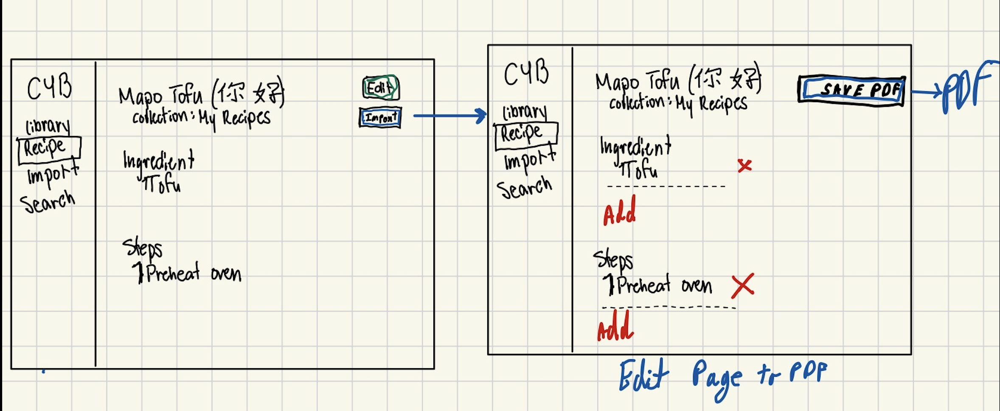

## Design Evolution

### Initial Wireframe

Inital wireframe plan. We wanted to have an export button that was on Recipie editor. Once teh user clicked on this button, we inteaded them to go to another Recipie editor like page to confirm what they wanted to send and then have them move to the final export to PDF button. We decided agaisnt this as its quite easy to just do that adn then send it if needed and allow most users to just directly export it.

### Final Wireframe

Final wireframe plan. We removed the extra step of editing and changed it with a native smaller pop-up to allow the user to chose more relevant things like name of file, location, tags on local disk, etc. We belive this would be more useful than pop-uping up an edit page again.

### Final implementation

After we implimented the plans from the wireframes, we notcied that some recipies wer not getting saved (solved bug). But there was no way to know if it worked or not until we went to our local files. We decided this was not convient to users and added a small indicator under the tittle of the recipie to indicate if it worked or not.